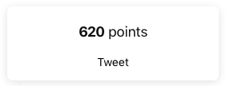

# nextapp

Hey there! This is me, working through the [NextJs tutorial](https://nextjs.org/learn/basics), likely making minor alterations. The whole repo could maybe turn into something else in the future. But maybe not. :fireworks:

I guess what I mean is it could potentially become my....next app :smirk:

So far, I'd super recommend the tutorial. It's really well done, and even has a swanky point system that turns it into a kind of game. If you're from the future, it could be different now than it is _now_. Where I am in time, the current version of Next is 9.3.0.

I'm putting it on Github in case I want to reference it in the future.

# :rainbow: :man_dancing:

Love, Pirtle

Update:
The tutorial quickly became a Zeit advertisement for their services and packages :man_shrugging:
I finished it out but didn't make further app updates. However...I did get all the points

